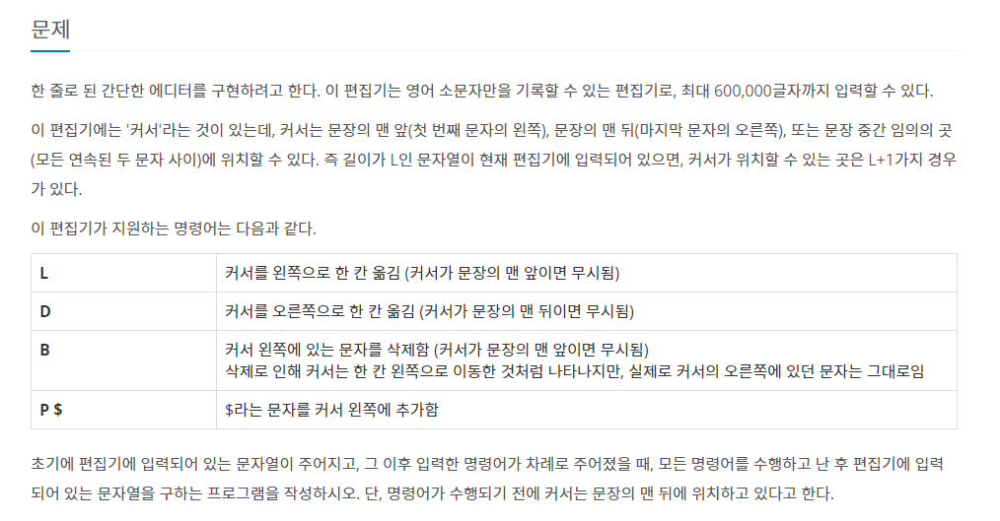
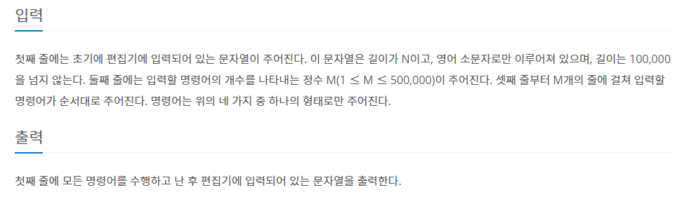

## 1 .문제 번호: 14060번_에디터

## 2. 문제 출처

https://www.acmicpc.net/problem/1874

## 3. 풀이과정

- 숫자 정수의 증가와 index의 증가를 나눠서 생각해야한다
- 해결할 수 없다면 NO를 출력해야하기 때문에 print문을 바로바로 쓰는게 아니라 결과 값을  따로 저장해서 사용해야했다.

## 4.어려웠던 점

- 문제를 이해하는데 조금 걸렸다
- 중간에 리스트에 요소가 들어있는지 확인하는 `std[top] in not stack`을 사용했다가 시간 복잡도가 증가하여 시간초과로 통과하지 못했었다.

## 처음 코드

```python
import sys
sys.stdin = open("input.txt")

T = int(sys.stdin.readline()) # 테스트 케이스

for tc in range(1,T+1): #테스트 케이스 만큼 반복
   data = list(sys.stdin.readline())
   m = int(sys.stdin.readline())
   idx = len(data)
   for i in range(m):
       order = list(sys.stdin.readline().split())
       if order[0] == 'P':
           data.insert(idx,order[1])
           idx += 1
       elif order[0] == 'L':
            if idx:
                idx -= 1
       elif order[0] == 'D':
            if idx != len(data):
                idx += 1
       elif order[0] == 'B':
           if idx:
               data.pop(idx-1)
               idx -= 1

   for c in data:
       print(c,end='')
   print()
```


[l_data]  cursor [r_data]

## 최종

```python
import sys

l_data = list(sys.stdin.readline().strip())
m = int(sys.stdin.readline())
r_data = []
for i in range(m):
   com = sys.stdin.readline().strip()
   if com[0] == 'P':
       l_data.append(com[2]) #문열 추가
   elif com[0] == 'L':
        if l_data:
            r_data.append(l_data.pop())
   elif com[0] == 'D':
        if r_data:
            l_data.append(r_data.pop())
   elif com[0] == 'B':
        if l_data:
           l_data.pop()

print(''.join(l_data + list(reversed(r_data))))
```


