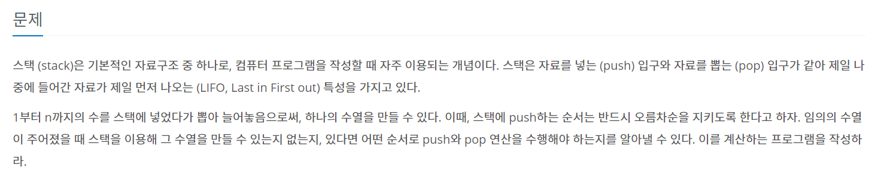
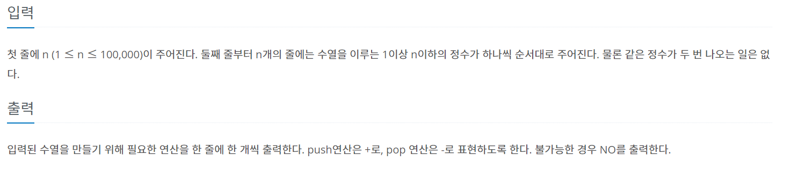
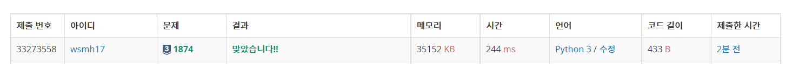

## 1 .문제 번호: 1874번

## 2. 문제 출처

https://www.acmicpc.net/problem/1874

## 3. 풀이과정

- 숫자 정수의 증가와 index의 증가를 나눠서 생각해야한다
- 해결할 수 없다면 NO를 출력해야하기 때문에 print문을 바로바로 쓰는게 아니라 결과 값을  따로 저장해서 사용해야했다.

## 4.어려웠던 점

- 문제를 이해하는데 조금 걸렸다
- 중간에 리스트에 요소가 들어있는지 확인하는 `std[top] in not stack`을 사용했다가 시간 복잡도가 증가하여 시간초과로 통과하지 못했었다.

## 최종 코드

```python
import sys
sys.stdin = open("input.txt")

T = int(sys.stdin.readline()) # 테스트 케이스

for tc in range(1,T+1): #테스트 케이스 만큼 반복
   stack = [] # 빈스택
   n = int(sys.stdin.readline())
   std =[int(sys.stdin.readline()) for i in range(n)]
   result = []
   top = 0
   num = 1

   while top < n:
       if std[top] >= num: # std[top] in not stack으로 사용했다가 시간초과 발생,현재 스택에 없다면
           stack.append(num)
           result.append('+')
           num += 1
       elif std[top] == stack[-1]: #스택 끝자리에 찾고자 하는 답이 있다면
           stack.pop(-1)
           result.append('-')
           top += 1
       else:
           print('NO')
           break
   else:#while문을 break하지 않았다면
       for ans in result:
           print(ans)
```



