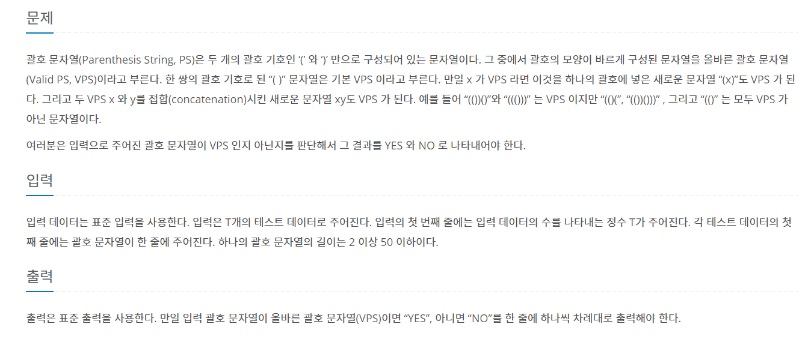
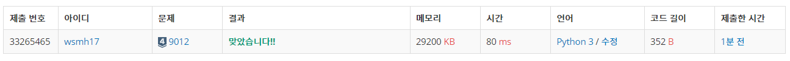

## 1 .문제 번호: 9012번

## 2. 문제 출처

https://www.acmicpc.net/status?user_id=wsmh17&problem_id=9012&from_mine=1

## 3. 풀이과정

- 스택의 기본 개념을 이용해 풀 수 있다.
- 여는 괄호가 나올경우 stack에 저장하고, 닫는 괄호가 나올 경우 stack에 여는 괄호가 있는지 확인후 이상 있을 겨
- 마지막까지 확인후 스택에 자료가 남아있으면 NO를 출력한다

## 4.어려웠던 점

- 없다

## 최종 코드

```python
import sys
sys.stdin = open("input.txt")

T = int(input())

for tc in range(1,T+1):
   stack = [] # 빈스택
   datas = input()
   ans = 'YES'
   for data in datas:
       if data == '(':
           stack.append(data)
       else:
           if stack: #스택이 있을경우
                stack.pop(-1) # 맨위의 숫자를 pop
           else: # 빈스택일 경우
               ans = 'NO' #NOf
               break
   if stack:
        ans = 'NO'
   print(ans)

```


